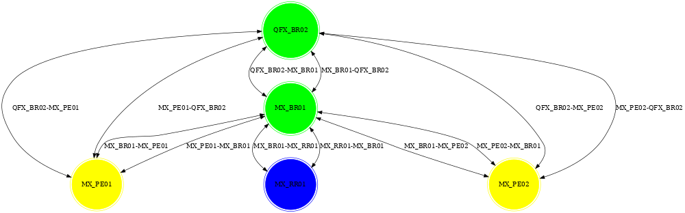

# Junos ISIS DB Visualization

```
Author: Manish Arora
Version: Revision: 0.1
```

## Interpretation
isis_db_visualize.py python3 script converts [JUNOS "show isis database detail | display json"](https://www.juniper.net/documentation/en_US/bti-series/bti78004.3/topics/reference/general/r-7800-cliref-show-isis-database.html) output into dot format that can visualized using [Graphviz](https://graphviz.org/)

## Sample .png auto generated from [sample dot file](samples/isis_db.dot)
<fig>
<figcaption text-align: "center"> isis_db.png </figcaption>

</fig><br>

## Usage
* Clone the repository on system with Python3
* Create text file with output of "show isis database detail | display json"
* Run as shown in the screen capture below. Customization field is optional and searches for a regular expression to change color. 
<fig1>
<figcaption text-align: "center"> Usage Screen Capture: </figcaption>

</fig1><br>
* Successful execution of script should create a dot file as shown in [samples](samples/isis_db.dot)
* Resultant dot file can be converted into png, jpeg or pdf format as shown below.
<fig2>
<figcaption text-align: "center"> isis_db.dot to isis_db.png: </figcaption>

</fig2><br>

## Graphviz Install
Graphiz can be easily installed on your choice of operating system as shown [here](https://graphviz.org/download/)
Caveats
* Windows 10 Install is avilable [here](https://www2.graphviz.org/Packages/stable/windows/10/cmake/Release/Win32/)
* Run **dot.exe -c** post installation inside Graphiz installed directory
* Ubuntu requires **libgts-dev** to run sfdp 
